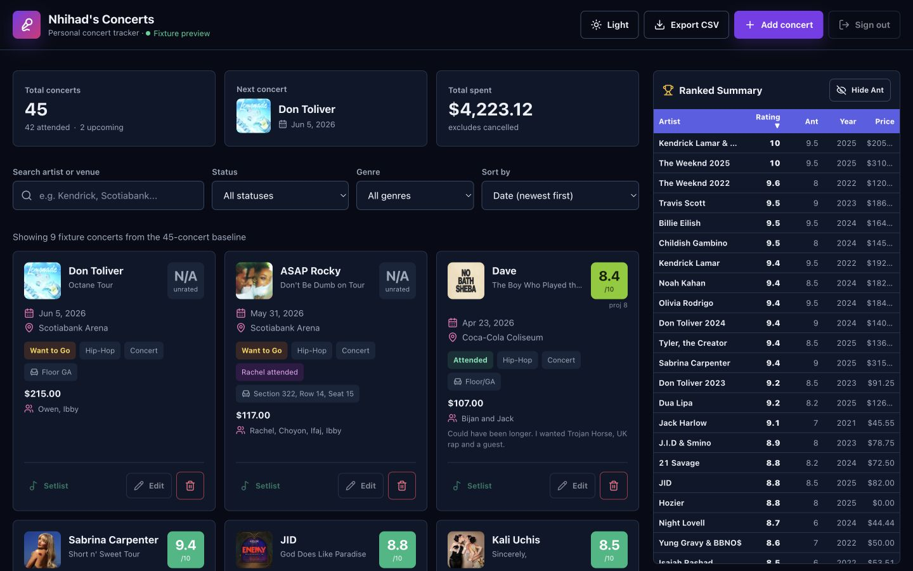
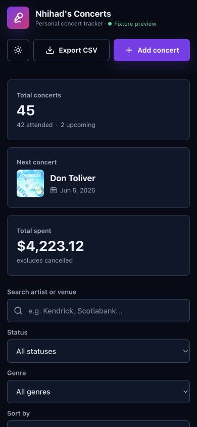

# Stage 1 Checkpoint

Captured: 2026-06-29

## Completed

- Created `frontend/`, `backend/`, `supabase/migrations/`, and `sync/` foundations.
- Scaffolded React 19, Vite, TypeScript, FastAPI, Pytest, Ruff, Oxlint, and Vitest.
- Rebuilt the dashboard shell from in-memory fixtures only.
- Preserved the sticky header, three headline stats, filters, three-column card grid, sticky ranked sidebar, dark/light themes, CSV export, and add-concert dialog.
- Added responsive desktop, tablet, and mobile layouts with complete reduced-motion fallbacks.
- Configured Vercel Services with Vite at `/` and FastAPI at `/api`.
- Added a typed read-only health endpoint at `/api/v1/health`.
- Added frontend tests for shell rendering and filtering.
- Added backend tests for the health contract and the absence of write routes.

## Verification

- `npm run check`: pass.
- `npm run build`: pass.
- Local Vercel Services detected both services and returned `200` from `/api/v1/health`.
- Desktop browser at 1440 x 900: nine cards, 22 ranked rows, no horizontal overflow, no Vite error overlay.
- Mobile browser at 390 x 844: nine cards, no horizontal overflow, 362px cards inside the viewport.
- Add-concert dialog: opens, exposes ten controls, fits the mobile viewport, and closes correctly.
- Search: filtering for Kali returns only Kali Uchis and updates the result count.
- Preview deployment: `Ready`.
- Protected preview root: HTTP `200` through Vercel's authenticated curl.
- Protected preview health endpoint: HTTP `200` with `data_mode: fixtures`.
- Vercel error-log scan: no errors found.

## Preview

- URL: https://concert-tracker-qpg34gm0r-nhihadhassan-2432s-projects.vercel.app
- Deployment: `dpl_GHus4MUuzAm6dyCteUJhXiydJPKY`
- Target: preview only
- Protection: Vercel authentication is enabled
- Frontend bundle: 216.37 kB JavaScript and 13.44 kB CSS before compression
- Backend function bundle: 5.09 MB

The first preview attempt failed because the unanchored `data/` ignore rule also excluded `frontend/src/data/fixtures.ts`. Anchoring the private backup rule to `/data/` fixed the upload without exposing private backup files.

## Screenshots

Baseline screenshots remain in `docs/reference/current/` for side-by-side review.

## Known Limits

- The fixture shell displays nine representative cards and 22 ranking rows while retaining the 45-concert baseline totals.
- Add and delete actions affect memory only and reset on refresh.
- Edit, setlist, and sign-out controls are intentionally disabled until their owning stages.
- Authentication, Supabase reads, Supabase writes, rating calculations, and realtime sync are not present.
- Mobile cards begin below the stacked stats and filters, matching the baseline limitation scheduled for Stage 6.

## Rollback

- Production remains the legacy static application and was not changed.
- Delete the preview deployment if it is no longer needed.
- Revert the Stage 1 commit to return the repository to the approved Stage 0 baseline.

## Checkpoint Result

**PASS - awaiting approval before Stage 2.**

Stage 2 must not begin until this checkpoint is explicitly approved.
